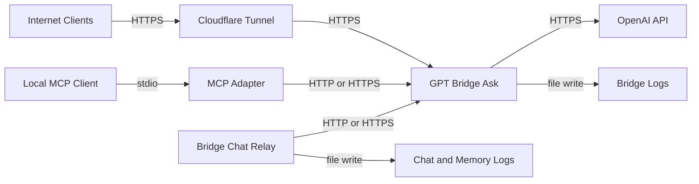

# bitpod-tools Threat Model

## Executive summary
The highest-risk theme is internet exposure of the GPT bridge endpoint (`/ask`) with bearer/secret-only authentication and no request-level authorization partitioning. In this repo state, compromise of bridge credentials or weak operational controls around tunnel exposure would enable prompt injection relay, token abuse (cost/DoS), and sensitive operator-context exfiltration from chat/memory logs. Secondary risks are integrity and confidentiality of local JSONL logs and memory-sync workflows in `bridge_chat.py`, which currently trust local filesystem controls.

## Scope and assumptions
- In-scope paths:
  - `/Users/cjarguello/bitpod-app/bitpod-tools/gpt_bridge`
  - `/Users/cjarguello/bitpod-app/bitpod-tools/costs`
  - `/Users/cjarguello/bitpod-app/bitpod-tools/audit_ctl.sh` (operational helper, low runtime criticality)
- Out-of-scope:
  - Product app repos outside this directory.
  - Cloudflare/Zulip dashboard configuration not represented in this repo.
- Clarified assumptions from user:
  - `https://gpt-bridge.bitpod.app/ask` is intended to be internet-reachable for current Taylor/Zulip workflow.
  - No customers yet; data sensitivity is primarily operator/team internal data (not customer PII by design).
  - Single-tenant operation (owner + automation agents), no tenant isolation requirement yet.
- Remaining assumptions:
  - Tunnel and DNS controls are managed by a single trusted operator account.
  - No additional gateway/WAF auth layer sits in front of `/ask` beyond token/secret.

Open questions that would materially change ranking:
- Is there any IP allowlisting or Cloudflare Access policy in front of `/ask`?
- Are `.env` and `logs/` directories ever synced to external storage/backups without encryption?

## System model
### Primary components
- **Bridge HTTP service**: `gpt_bridge/gpt_bridge.py` exposes `POST /ask` and forwards to OpenAI Responses API using `OPENAI_API_KEY`.
- **Bridge clients/wrappers**: `ask_gpt.py`, `ask_once.sh`, `bridge_ctl.sh` invoke local or remote bridge endpoint via `GPT_BRIDGE_URL`.
- **MCP adapter**: `gpt_bridge_mcp.py` exposes MCP tool `gpt_bridge_ask` and forwards to bridge URL.
- **Chat/memory relay**: `bridge_chat.py` logs messages/events, performs memory extraction/sync, and relays `@gpt` mentions through bridge.
- **Data stores (local files)**: `gpt_bridge/logs/bridge.jsonl`, `gpt_bridge/logs/chat.jsonl`, `gpt_bridge/logs/memory_store.jsonl`.
- **External services**: OpenAI API (`https://api.openai.com/v1/responses`), Cloudflare tunnel/domain, Zulip.

### Data flows and trust boundaries
- **Internet/Zulip/automation clients -> Bridge HTTP (`/ask`)**
  - Data: prompts, context, metadata, auth token/secret.
  - Channel: HTTPS (remote) or HTTP loopback (local default).
  - Guarantees: bearer token and/or shared secret check in app code.
  - Validation: JSON schema-like validation through `GPTRequest.from_dict`.
  - Evidence: `gpt_bridge/gpt_bridge.py` (`BridgeHandler.do_POST`, `_is_authorized`), `gpt_bridge/schemas.py`.
- **Bridge HTTP -> OpenAI Responses API**
  - Data: prompt/context payload and constraints; OpenAI API key.
  - Channel: HTTPS via `urlopen`.
  - Guarantees: TLS to OpenAI endpoint.
  - Validation: none on remote response shape beyond local parsing/coercion.
  - Evidence: `gpt_bridge/gpt_bridge.py` (`OPENAI_URL`, `call_openai`).
- **Bridge + chat relay -> local logs/memory store**
  - Data: request/response payloads, messages, memory extracts, status/error text.
  - Channel: local filesystem writes.
  - Guarantees: OS file permissions only; no cryptographic integrity controls.
  - Validation: append-only JSONL writes, permissive reads.
  - Evidence: `gpt_bridge/gpt_bridge.py` (`_log_jsonl`), `gpt_bridge/bridge_chat.py` (`append_event`, `_append_memory_items`).
- **MCP clients -> MCP adapter -> Bridge**
  - Data: tool args including message/context.
  - Channel: MCP stdio + HTTP POST to bridge URL.
  - Guarantees: depends on token/secret env forwarding.
  - Validation: argument checks in `_call_bridge`.
  - Evidence: `gpt_bridge/gpt_bridge_mcp.py`.

#### Diagram

## Assets and security objectives
| Asset | Why it matters | Security objective (C/I/A) |
|---|---|---|
| `OPENAI_API_KEY` | Enables external API spend and data relay | C, I |
| `GPT_BRIDGE_TOKEN` / `GPT_BRIDGE_SHARED_SECRET` | Controls access to `/ask` endpoint | C, I |
| Prompt/context payloads | May contain private planning, operational details, credentials by mistake | C |
| `logs/*.jsonl` and `memory_store.jsonl` | Persists conversation/memory state; useful for attacker recon and data theft | C, I |
| Bridge availability (`/ask`) | Zulip/Taylor workflow depends on it | A |
| Request routing/model constraints | Integrity affects quality/safety of downstream decisions | I |
| Cloudflare tunnel exposure config | Defines internet attack surface | C, I, A |

## Attacker model
### Capabilities
- Remote unauthenticated internet attacker can reach bridge endpoint if DNS+tunnel expose it.
- Authenticated attacker with stolen token/secret can submit arbitrary prompts and consume resources.
- Local attacker/process with filesystem access can read or tamper with JSONL logs.
- Prompt attacker can attempt model-output shaping to influence extracted memory and downstream automation behavior.

### Non-capabilities
- No multi-tenant boundary bypass scenario is in-scope (single-tenant operation).
- No customer database direct exfiltration path is evidenced in this repo.
- No code execution primitive is directly exposed by bridge request handling (input is parsed, not executed as code).

## Entry points and attack surfaces
| Surface | How reached | Trust boundary | Notes | Evidence (repo path / symbol) |
|---|---|---|---|---|
| `POST /ask` | Internet via domain/tunnel or local URL | External caller -> bridge service | Core auth and validation chokepoint | `/Users/cjarguello/bitpod-app/bitpod-tools/gpt_bridge/gpt_bridge.py` (`do_POST`, `_is_authorized`) |
| MCP tool `gpt_bridge_ask` | MCP stdio clients | MCP client -> bridge | Forwards args to `GPT_BRIDGE_URL`; auth header from env | `/Users/cjarguello/bitpod-app/bitpod-tools/gpt_bridge/gpt_bridge_mcp.py` (`_call_bridge`, `_build_headers`) |
| CLI wrapper `ask_gpt.py` | Local shell scripts/users | Operator shell -> bridge | Can post to remote bridge URL from env | `/Users/cjarguello/bitpod-app/bitpod-tools/gpt_bridge/ask_gpt.py` |
| Chat command relay | `bridge_chat.sh chat` / team command aliases | User text -> GPT relay + memory pipeline | Mention parsing and auto memory operations | `/Users/cjarguello/bitpod-app/bitpod-tools/gpt_bridge/bridge_chat.py` (`run_team`, `_finalize_session_memory`) |
| Log files | Local FS reads/writes | App process -> filesystem | Contains high-value transcript and trace content | `/Users/cjarguello/bitpod-app/bitpod-tools/gpt_bridge/gpt_bridge.py` (`_log_jsonl`), `bridge_chat.py` (`append_event`) |

## Top abuse paths
1. **Bridge credential theft -> unauthorized prompt relay**
   1. Attacker obtains `GPT_BRIDGE_TOKEN` (shell history, leaked file, screenshot).
   2. Calls exposed `/ask` directly.
   3. Uses bridge as a proxy to OpenAI API, consuming budget and extracting behavior details.
2. **Internet scanning -> brute-force / weak token abuse**
   1. Attacker discovers `gpt-bridge.bitpod.app`.
   2. Replays or guesses weak token/secret.
   3. Gains persistent unauthorized endpoint use and availability impact.
3. **Prompt payload inflation -> cost/availability degradation**
   1. Authenticated caller sends large contexts repeatedly.
   2. Bridge forwards high-token requests to OpenAI.
   3. Budget depletion and degraded service responsiveness.
4. **Log disclosure -> sensitive ops context leakage**
   1. Local compromise or misconfigured backup exposes `logs/*.jsonl`.
   2. Attacker reads prompts, responses, and operational metadata.
   3. Gains strategic context for further compromise/social engineering.
5. **Memory poisoning via prompt injection**
   1. Attacker influences conversation text.
   2. `bridge_chat.py` extracts and persists "durable memory."
   3. Future agent decisions are biased by malicious memory entries.
6. **Remote endpoint drift/misconfig**
   1. `GPT_BRIDGE_URL` changed to attacker-controlled URL.
   2. Wrappers and MCP adapter forward sensitive context to rogue endpoint.
   3. Confidentiality loss and incorrect automation outputs.

## Threat model table
| Threat ID | Threat source | Prerequisites | Threat action | Impact | Impacted assets | Existing controls (evidence) | Gaps | Recommended mitigations | Detection ideas | Likelihood | Impact severity | Priority |
|---|---|---|---|---|---|---|---|---|---|---|---|---|
| TM-001 | External attacker with stolen token | Token/secret exposed via ops error or local compromise | Calls `/ask` to run arbitrary prompts through bridge | Unauthorized usage, potential context exfil, spend abuse | Bridge token/secret, prompt context, availability | Token/secret required in `_is_authorized`; request schema checks (`gpt_bridge.py`, `schemas.py`) | Single shared credential; no per-client identity, no rotation policy in code, no rate limit | Add Cloudflare Access allowlist + short-lived scoped tokens + explicit rotation runbook and forced expiry | Alert on anomalous request volume and new source IP patterns in edge logs | Medium | High | High |
| TM-002 | Internet attacker | Public DNS/tunnel exposure and insufficient edge protections | Scans and attacks exposed endpoint with replay/credential stuffing | Service disruption or unauthorized access if secret weak/leaked | Availability, auth artifacts | Default local bind unless override (`BridgeConfig.validate_startup`) | Remote mode allows exposure with no in-app throttling/captcha/IP control | Enforce edge auth (CF Access), IP allowlist for known bots, per-source rate limits | Monitor 401/403 spikes, path scans, burst traffic | Medium | Medium | Medium |
| TM-003 | Authenticated malicious/compromised caller | Valid token/secret | Sends oversized/high-rate requests to exhaust budget and latency | Cost blowout and degraded bridge responsiveness | OpenAI key spend, availability | `max_tokens` can be passed, but caller-controlled; no hard cap server-side | No quota enforcement in `gpt_bridge.py`; no request body size limits | Add server-side max body and max_tokens caps + per-minute quotas per caller + circuit breaker | Cost anomaly alerts via `cost_ctl.py` + request-rate alerting | High | Medium | High |
| TM-004 | Local attacker or compromised host process | Read access to repo/log paths | Reads `bridge.jsonl`, `chat.jsonl`, `memory_store.jsonl` | Leakage of sensitive prompts, workflow state, inferred secrets | Prompt/context logs, memory store | Files stored locally only; no explicit secret print in code | Logs are plaintext JSONL; no encryption-at-rest or redaction policy | Redact sensitive patterns before write, file permission hardening, optional encrypted log sink | File integrity monitoring and unexpected file-access telemetry | Medium | Medium | Medium |
| TM-005 | Prompt attacker influencing chat stream | Ability to inject crafted messages into relay flow | Poisons extracted memory items and sync payloads | Long-lived bad guidance, decision integrity degradation | Memory store integrity, downstream automation quality | Structured extraction path in `bridge_chat.py` with JSON parsing | No provenance/approval gate for memory entries; no trust scoring beyond model output | Require operator approval for memory writes in high-risk sessions; add source tagging and denylist rules | Alert when new memory items contain risky patterns or abrupt topic shifts | Medium | Medium | Medium |
| TM-006 | Config attacker / accidental misconfiguration | Ability to change env vars or startup scripts | Redirects `GPT_BRIDGE_URL` to rogue endpoint | Data exfiltration and silent man-in-the-middle at app layer | Prompt/context confidentiality, integrity | Env-based config simplicity (`ask_gpt.py`, `gpt_bridge_mcp.py`) | No endpoint allowlist/certificate pinning at app layer | Enforce allowlisted hostnames and startup config validation checks | Emit startup warning+fail on unknown hostnames; hash and monitor env config | Medium | High | High |

## Criticality calibration
- **Critical** (none currently assigned): direct pre-auth compromise causing immediate full secret/key theft or host takeover with broad blast radius.
  - Example threshold for this repo: unauthenticated bypass of `/ask` auth checks at internet edge plus unrestricted command execution.
- **High**:
  - Stolen bridge credentials enabling unauthorized bridge use at scale (TM-001).
  - Config redirection of bridge endpoint causing silent data exfiltration (TM-006).
  - Unbounded cost/DoS via authenticated request flooding (TM-003).
- **Medium**:
  - Public endpoint probing and attack noise with partial controls (TM-002).
  - Plaintext operational log leakage from local host/storage compromise (TM-004).
  - Memory poisoning that corrupts decision quality but not direct host compromise (TM-005).
- **Low**:
  - Operational misfires that do not materially affect confidentiality/integrity/availability (no major examples in current scope).

## Focus paths for security review
| Path | Why it matters | Related Threat IDs |
|---|---|---|
| `/Users/cjarguello/bitpod-app/bitpod-tools/gpt_bridge/gpt_bridge.py` | Primary auth, request parsing, external API forwarding, logging | TM-001, TM-002, TM-003, TM-004 |
| `/Users/cjarguello/bitpod-app/bitpod-tools/gpt_bridge/gpt_bridge_mcp.py` | MCP->HTTP forwarding and auth header construction | TM-001, TM-006 |
| `/Users/cjarguello/bitpod-app/bitpod-tools/gpt_bridge/bridge_chat.py` | Chat relay, memory extraction/sync, persistent event logging | TM-004, TM-005 |
| `/Users/cjarguello/bitpod-app/bitpod-tools/gpt_bridge/bridge_ctl.sh` | Runtime control logic and remote/local endpoint behavior | TM-002, TM-006 |
| `/Users/cjarguello/bitpod-app/bitpod-tools/gpt_bridge/ask_gpt.py` | Client-side endpoint and auth usage path | TM-001, TM-006 |
| `/Users/cjarguello/bitpod-app/bitpod-tools/gpt_bridge/config.example.env` | Secret and endpoint configuration contract | TM-001, TM-006 |
| `/Users/cjarguello/bitpod-app/bitpod-tools/costs/cost_ctl.py` | Cost anomaly signal path for abuse detection | TM-003 |

## Quality check
- Entry points covered: `/ask`, MCP tool, CLI wrapper, chat relay, local logs.
- Trust boundaries represented in threats: external->bridge, bridge->OpenAI, bridge/chat->filesystem, MCP->bridge.
- Runtime vs dev/CI separation: runtime-focused; `audit_ctl.sh` and cost tooling treated as supportive, not primary runtime attack surface.
- User clarifications incorporated: internet-reachable use, low customer-data exposure, single-tenant design.
- Assumptions and open questions explicit: yes (scope/assumptions + open questions sections).
